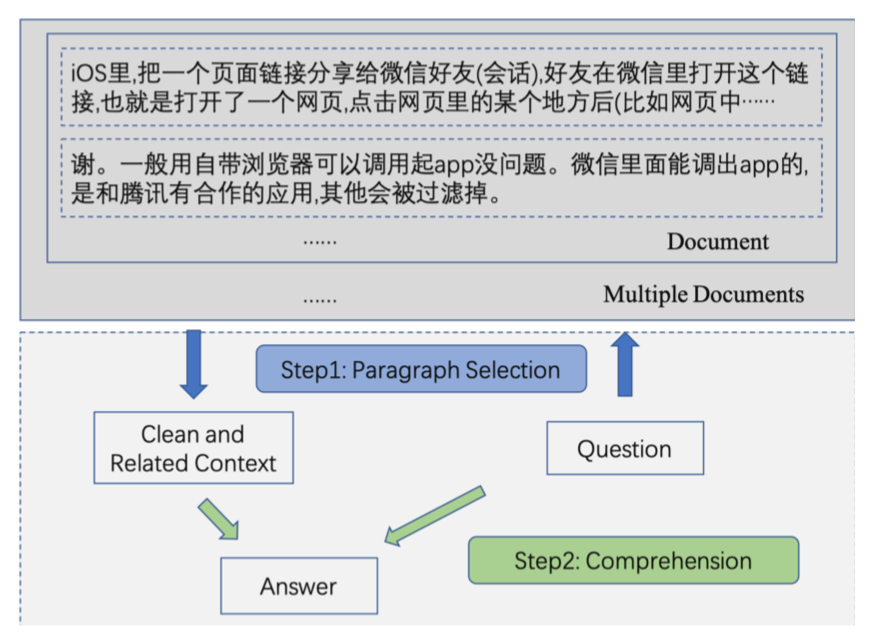
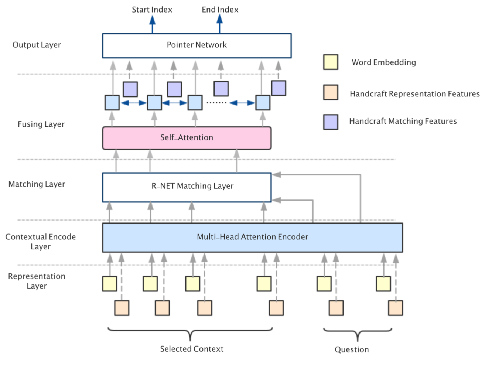
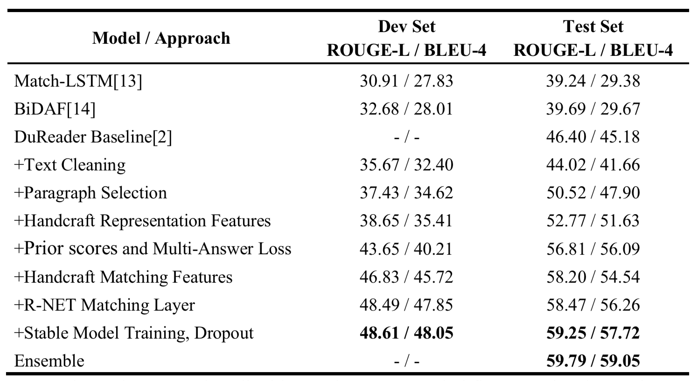

# lic2019-dureader2.0-rank2
The Rank2 solution (**no-BERT**) of [2019 Language and Intelligence Challenge - DuReader2.0 Machine Reading Comprehension](http://lic2019.ccf.org.cn/read).

## Architecture
<p align="center">

</p>

Our MRC system answer questions in two steps：
- Text Preprocess：where documents are preprocessed and relevant paragraphs to the question are retrieved.
- Multi-Task Learning Comprehension Model：where the question and retrieved articles are processed to derive answers.

## Text Preprocess
1. Text Cleaning
- We segment the raw text into list of words using Jieba, an opensource Chinese word segmentation tool. The important point is that original DuReader dataset con- tains many URLs, directly segment these URLs will increase the vocabulary size dramatically, and many of these words don’t have pretrained word embeddings. So we retrieve these URLs from original raw documents and build a URL mapping dictionary, and add this URLs to the custom dictionary of Jieba. So these URLs will participate in word segmentation as a whole. This method increase the word cover- age of the pretrained word embeddings, simple yet powerful.
- We remove the html tags and website name for the title of document, and remove the html tags when the document is not about a programming language.
- Original document may contains some oral text, while the labeled answer don’t have these noisy text. So we correct some misspelled words according to words that out of the pretrained vocabulary. And we remove some specific text like duplicate words or punctuations according to the regular expressions.
- We remove some empty strings, especially the escaped empty strings for web pages, like \u200b, \x0a and etc. And we remove all empty paragraphs and duplicate para- graphs in one document.

After per- forming text cleaning, the word coverage increased from 42.60% to 56.08% for Zhidao dataset and increased from 38.79% to 54.36% for Search dataset respectively.

2. Paragraph Selection
- The title of the document is extracted, not only the title is relevant to the document, but some titles contain the answers.
- For each document, we calculate the match score between paragraph and question. The first solution to last year's DuReader competition was to just calculate the BLEU-4 score, in this paper, we calculate the BLEU-4 and F1 score, and combine them using different weights.
- We arrange paragraphs in descending order of match score and ascending order of paragraph length. Baseline system of DuReader just select top K(K=3) paragraphs, maybe the passage where the answer lies has been screened out. We concatenate the arranged paragraphs until reach the predefined maximum length.
- Finally, we concatenate all paragraphs to form a clean and related context, and truncate to the maximum length.

## Multi-Task Learning Comprehension Model
<p align="center">

</p>

## Features
- Word-level embedding: Use pretrained word embeddings to map each word to its corresponding n-dimensional embedding vector 𝑤5. As the vocabulary size is very big and there exists many out of the vocabulary words, the embedding matrix would be so big that almost all parameters of the model come from the embedding matrix. We filter the words that occur less than 2 count and map these words to <UNK> word, and just train the embeddings of the <UNK>. This method reduces the vocab- ulary size and increases the word coverage a lot, therefore often improves the effec- tiveness of training.
- POS tag embedding: We extract the POS tag of each word in the question and pas- sage, and mapped to a one-hot embedding 𝑝5. To prevent sparsity, we just select occurred top-K frequency POS tag, others are mapped to <other>. At the same time, we use the training set to count the frequency of each POS tag and combine the frequency feature to 𝑝5.
- Keyword feature: We calculate keyword feature kw for each word, indicating the word is whether a keyword for question and passage, to some extent, it reflects the importance of the word in a sentence.
- Word-in-question feature: We calculate one binary feature 𝑤𝑖𝑞 for word in passage that indicate whether the word occurs in the question. And we multiply the keyword feature with word-in-question feature to indicate whether the keyword occurs in the question.
- Question category feature: We use some rules to classify the problem into coarse- grained and fine-grained categories. The coarse-grained categories include Entity, Description and YesNo. The fine-grained categories include When, What, Who, Where, Why, How, How long, Rank, Solution and etc. Each category is mapped to a m-dimensional embedding

## Experiment
<p align="center">

</p>

## How to use
1. Preprocess the text and generate MRC dataset.
```bash
cd preprocesssh
sh run_1.text_cleaning.sh
sh run_2.remove_not_related_paras.sh
sh run_3.extract_paragraph.sh
sh run_4.gen_mrc_dataset.sh
sh run_5.remove_low_ceil_metric.sh
sh run_6.generate_para_match_score_feature.sh
```

2. Training the MRC model
```bash
cd ../tfmrc/
nohup python run.py --train --gpu 3 --desc 'data_v5' --train_answer_len_cut_bins 6 \
                    --max_a_len 400 --use_oov2unk false --trainable_oov_cnt_threshold 300 \
                    --rnn_dropout_keep_prob 1 --fuse_dropout_keep_prob 1 --weight_decay 0.00003 \
                    --algo RNET --hidden_size 168 --epochs 20 --evaluate_cnt_in_one_epoch 2 --batch_size 32 \
                    > rnet_data-v5_train.log 2>&1 &
```

## Teammates
Lucky Boys
- [QingLiu](https://github.com/SunnyMarkLiu)
- [ZiqiangYing](https://github.com/YingZiqiang)

## License
This project is licensed under the terms of the MIT license.
